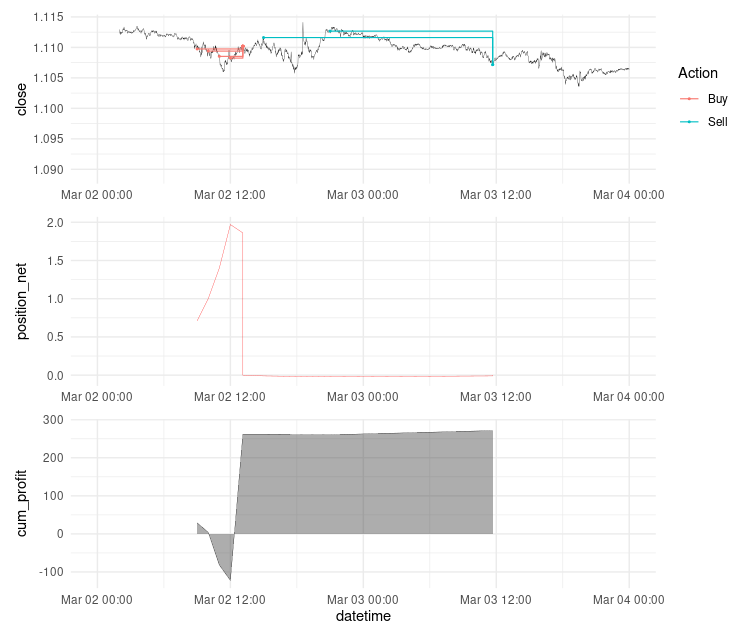

# Forex Trades

From trade data to net positions and profits

## Use

```
remotes::install_github("mgei/forextrades")

library(forextrades)
```

Original data could look like this:

```
trades 
# # A tibble: 1,970 × 11
#    `Open Date`         `Close Date`        Symbol Action  Lots    SL    TP `Open Price` `Close Price`  Pips Profit
#    <dttm>              <dttm>              <chr>  <chr>  <dbl> <dbl> <dbl>        <dbl>         <dbl> <dbl>  <dbl>
#  1 2022-01-17 10:00:04 2022-01-17 13:39:38 EURUSD Sell    0.03     0     0         1.14          1.14  10.6   3.18
#  2 2022-01-17 11:00:04 2022-01-17 13:39:38 EURUSD Sell    0.04     0     0         1.14          1.14  14.3   5.72
#  3 2022-01-17 05:00:01 2022-01-17 13:39:39 EURUSD Sell    0.01     0     0         1.14          1.14   0.5   0.05
#  4 2022-01-17 06:00:08 2022-01-17 13:39:39 EURUSD Sell    0.01     0     0         1.14          1.14   3.1   0.31
#  5 2022-01-17 07:00:01 2022-01-17 13:39:39 EURUSD Sell    0.02     0     0         1.14          1.14   4.4   0.88
#  6 2022-01-18 04:00:13 2022-01-18 15:14:27 EURUSD Sell    0.01     0     0         1.14          1.14  50.1   5.01
#  7 2022-01-18 03:00:00 2022-01-18 15:14:32 EURUSD Sell    0.01     0     0         1.14          1.14  49.2   4.92
#  8 2022-01-19 22:00:00 2022-01-20 01:02:21 EURUSD Sell    0.08     0     0         1.14          1.13   9.5   7.6 
#  9 2022-01-19 09:00:02 2022-01-20 01:02:22 EURUSD Sell    0.01     0     0         1.13          1.13  -8.3  -0.83
# 10 2022-01-19 12:00:03 2022-01-20 01:02:22 EURUSD Sell    0.02     0     0         1.13          1.13  -1.8  -0.36
# # ℹ 1,960 more rows
# # ℹ Use `print(n = ...)` to see more rows
```

Get to long format:

```
trades <- trades |> 
  filter(Action %in% c("Buy", "Sell"))
  
trade_l <- trade_long(trades)

trade_l
# # A tibble: 3,940 × 10
#     Lots Action Profit `Open Price` `Close Price`    id name       datetime            Trade price
#    <dbl> <chr>   <dbl>        <dbl>         <dbl> <int> <chr>      <dttm>              <chr> <dbl>
#  1  0.03 Sell     3.18         1.14          1.14     1 Open Date  2022-01-17 10:00:04 open   1.14
#  2  0.03 Sell     3.18         1.14          1.14     1 Close Date 2022-01-17 13:39:38 close  1.14
#  3  0.04 Sell     5.72         1.14          1.14     2 Open Date  2022-01-17 11:00:04 open   1.14
#  4  0.04 Sell     5.72         1.14          1.14     2 Close Date 2022-01-17 13:39:38 close  1.14
#  5  0.01 Sell     0.05         1.14          1.14     3 Open Date  2022-01-17 05:00:01 open   1.14
#  6  0.01 Sell     0.05         1.14          1.14     3 Close Date 2022-01-17 13:39:39 close  1.14
#  7  0.01 Sell     0.31         1.14          1.14     4 Open Date  2022-01-17 06:00:08 open   1.14
#  8  0.01 Sell     0.31         1.14          1.14     4 Close Date 2022-01-17 13:39:39 close  1.14
#  9  0.02 Sell     0.88         1.14          1.14     5 Open Date  2022-01-17 07:00:01 open   1.14
# 10  0.02 Sell     0.88         1.14          1.14     5 Close Date 2022-01-17 13:39:39 close  1.14
# # ℹ 3,804 more rows
# # ℹ Use `print(n = ...)` to see more rows
```

Add position and profit columns:

```
trade_l_netposition <- net_position(trade_l)

trade_l_netposition |> 
  select(datetime, price, position_net, price_chg, profit_from_change, cum_profit)
# # A tibble: 3,814 × 6
#    datetime            price position_net price_chg profit_from_change cum_profit
#    <dttm>              <dbl>        <dbl>     <dbl>              <dbl>      <dbl>
#  1 2022-01-17 05:00:01  1.14        -0.01      0                0           0    
#  2 2022-01-17 06:00:08  1.14        -0.02     25.0             -0.250      -0.250
#  3 2022-01-17 07:00:01  1.14        -0.04     13.0             -0.260      -0.510
#  4 2022-01-17 10:00:04  1.14        -0.07     62.0             -2.48       -2.99 
#  5 2022-01-17 11:00:04  1.14        -0.11     38.0             -2.66       -5.65 
#  6 2022-01-17 13:39:38  1.14        -0.08   -144.              15.8        10.2  
#  7 2022-01-17 13:39:38  1.14        -0.04      1.00            -0.0800     10.1  
#  8 2022-01-17 13:39:39  1.14        -0.03      0                0          10.1  
#  9 2022-01-17 13:39:39  1.14        -0.02     -1.00             0.0300     10.1  
# 10 2022-01-17 13:39:39  1.14         0         0                0          10.1  
# # ℹ 3,804 more rows
# # ℹ Use `print(n = ...)` to see more rows
```

Get data from https://site.financialmodelingprep.com/developer/docs. The API key must be saved in the file `.apikey`, or just `apikey = "12345..."`

```{r}
eurusd <- get_fmp_fx(from = "2022-03-02", apikey = read_file(".apikey"))
```

Visualize

```
profits <- trade_l_netposition |> 
  filter(as.Date(datetime) >= as.Date("2022-03-02"),
         as.Date(datetime) <= as.Date("2022-03-04")) |> 
  ggplot(aes(x = datetime, y = cum_profit)) +
  geom_area(alpha = 0.4) +
  geom_line(size = 0.1) +
  scale_x_datetime(limits = as.POSIXct(c(as.Date("2022-03-02"), as.Date("2022-03-04")))) +
  labs(x = "datetime")

netpos <- trade_l_netposition |> 
  filter(as.Date(datetime) >= as.Date("2022-03-02"),
         as.Date(datetime) <= as.Date("2022-03-04")) |> 
  ggplot(aes(x = datetime, y = position_net)) +
  geom_line(size = 0.1, color = "red") +
  scale_x_datetime(limits = as.POSIXct(c(as.Date("2022-03-02"), as.Date("2022-03-04")))) +
  labs(x = NULL)

chart <- eurusd |> 
  mutate(date = date + hours(7)) |> # fix time zone
  ggplot(aes(x = date, y = close)) +
  geom_line(size = 0.1) +
  geom_point(data = trade_l |> filter(as.Date(datetime) >= as.Date("2022-03-02"),
                                      as.Date(datetime) <= as.Date("2022-03-04")),
             aes(x = datetime, y = price, color = Action), size = 0.4) +
  geom_step(data = trade_l |> filter(as.Date(datetime) >= as.Date("2022-03-02"),
                                     as.Date(datetime) <= as.Date("2022-03-04")),
            aes(x = datetime, y = price, group = id, color = Action), size = 0.4) +
  scale_x_datetime(limits = as.POSIXct(c(as.Date("2022-03-02"), as.Date("2022-03-04")))) +
  labs(x = NULL)

library(patchwork)

chart/netpos/profits
```



